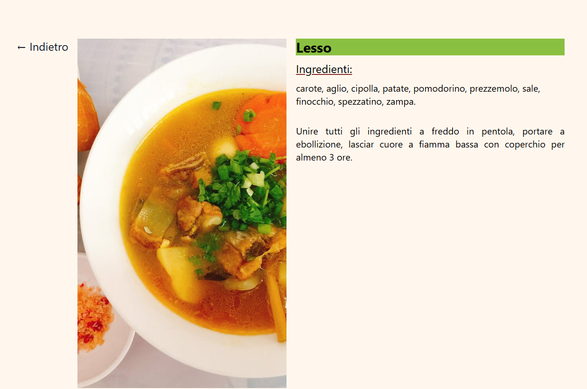
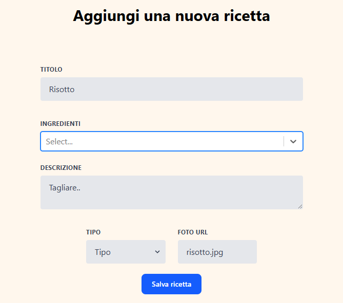
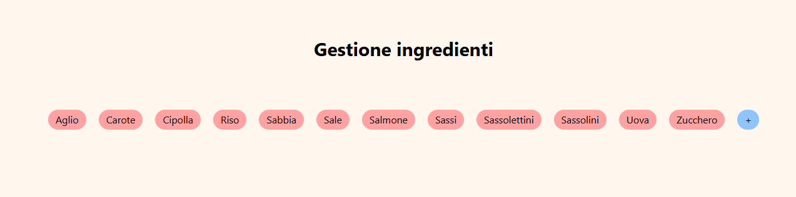
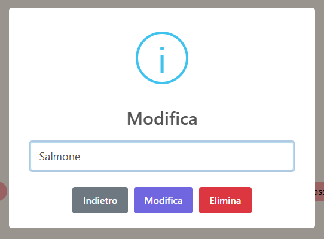
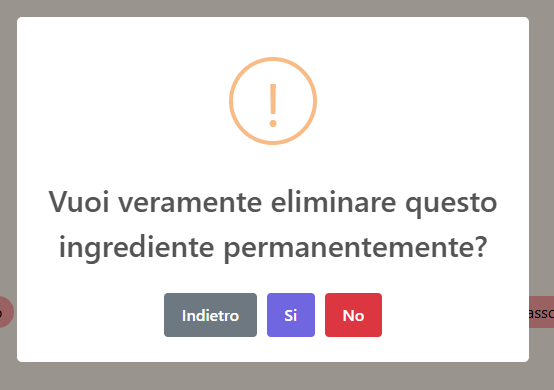

  <h3 align="center">Family Recipes</h3>

    
  

## About The Project

A small, simple recipe book used to digitalize all our family recipes. It gives our family the possibility to share recipes while living in different places.

The project has a small backend with minimal functionalities to save recipes in a dedicate server and modify/delete Recipes and Ingredients protected by a Login.

## TODO

- risolvi problema lettura ingredient in recipePage + editRecipe. JsIgnore
- migliora gestione ingredienti (quantities, plurale) 